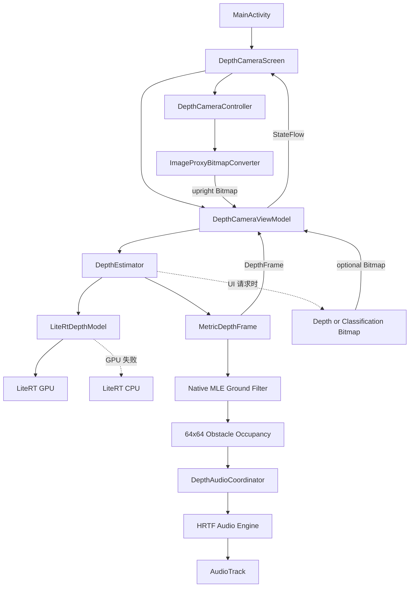

# Glasses - YOLO26 Depth Android MVP

这是一个纯原生 Android Kotlin 项目，用 CameraX 读取手机后置摄像头画面，
通过 LiteRT 在手机端运行 `yolo26n-depth_w8a32.tflite`，在内存中保留原始米制
深度数组，并使用 Jetpack Compose 实时显示可选的伪彩色深度图。

当前版本是后续开发的可运行基线，重点验证完整链路：

```text
摄像头 -> RGBA Bitmap -> 模型输入预处理 -> LiteRT GPU/CPU 推理
       -> MetricDepthFrame(FloatArray, meters)
       -> Native MLE 地面过滤 -> 64x64 obstacle occupancy
       -> 时间平滑/即时障碍检测 -> HRTF 双耳声音 -> AudioTrack
       -> 可选深度/分类 Bitmap -> Compose 屏幕
```

当前 MVP 已在 HONOR REP-AN00（Android 15）完成真机验证。GPU 推理、权限恢复、
前后台切换、锁屏恢复和屏幕旋转均已跑通。详细结果见
[MVP_VERIFICATION.md](MVP_VERIFICATION.md)。

## 当前功能

- 使用 CameraX 绑定后置摄像头。
- 只分析最新帧，避免推理速度低于摄像头帧率时形成任务堆积。
- 将相机 RGBA 帧转换为方向正确的 Android `Bitmap`。
- 从 APK assets 加载本地 TFLite 模型，不依赖网络下载。
- LiteRT 优先使用 GPU；GPU 初始化失败时自动回退到 CPU。
- 支持识别 NCHW/NHWC RGB 输入布局。
- 将单通道米制深度张量作为正式推理结果保留在内存中。
- 使用 C++/NDK 执行 MLE 地面拟合、全画面分类和 64x64 障碍物占用映射。
- 在内存中对占用网格做时间平滑、迟滞和新障碍物检测。
- 使用 64x64 HRTF 数据生成主声景和即时提示，并通过 `AudioTrack` 在手机端播放。
- 可选择是否把深度张量映射为伪彩色图；颜色映射不会修改原始深度。
- 可切换固定四色分类显示；关闭时不请求 native 写入 classMap。
- 记录每帧有限正值比例、最小值、最大值以及近似 P10/P50/P90。
- 屏幕显示实际加速器、FPS、单次模型推理时间和当前深度范围。
- 支持相机运行时权限，以及从系统设置授权后返回应用自动恢复。
- 包含纯 JVM 测试和需要真机运行的 Android instrumentation 测试。

当前版本不包含原始摄像头预览、目标检测框、录像、独立测距传感器、NPU、网络模型下载或
双画面界面。

## 技术基线

| 项目 | 当前配置 |
|---|---|
| 语言 | Kotlin 2.2.10 |
| UI | Jetpack Compose + Material 3 |
| 相机 | CameraX 1.6.0 |
| 推理 | LiteRT 2.1.5 `CompiledModel` |
| Android Gradle Plugin | 9.3.2 |
| Gradle | 9.5.0 |
| Java | 17 |
| NDK | `30.0.16138531` (`r30-beta3`) |
| CMake | 3.22.1 |
| Native ABI | `arm64-v8a` |
| `minSdk` | 26 |
| `targetSdk` / `compileSdk` | 37 |
| 应用 ID | `com.example.glasses` |
| 模型 | `yolo26n-depth_w8a32.tflite`，约 5.2 MiB |
| 当前模型输入/输出 | RGB `640x640` / depth `640x640` |

## 代码架构

项目按职责分为 UI、相机、推理、地面过滤、障碍网格和音频处理。依赖方向保持从上层
业务编排指向下层实现，不让 Compose 页面直接操作张量、LiteRT 或 native 工作缓冲区。



### 运行时数据流

1. `MainActivity` 创建 Compose 页面。
2. `DepthCameraScreen` 请求相机权限，同时要求 ViewModel 初始化模型。
3. 模型准备完成且权限已授予后，页面启动 `DepthCameraController`。
4. CameraX 输出 `RGBA_8888 ImageProxy`，并使用
   `STRATEGY_KEEP_ONLY_LATEST` 保留最新帧。
5. `ImageProxyBitmapConverter` 处理 row padding、裁剪和旋转，返回直立 Bitmap。
6. `DepthCameraViewModel` 使用 `AtomicBoolean` 保证同一时刻只处理一帧；繁忙时
   新到达的 Bitmap 会被释放。
7. `DepthEstimator` 将画面缩放到模型尺寸、归一化 RGB 到 `[0, 1]`，然后调用
   `LiteRtDepthModel`。
8. 模型输出的 Float 深度数组不做单位换算，直接封装为米制 `MetricDepthFrame`。
9. Native MLE 使用下方 ROI 拟合地面，但从画面顶部开始分类，并直接生成 64x64
   obstacle occupancy；只有分类显示开启时才额外写入 classMap。
10. `DepthAudioCoordinator` 消费最新 occupancy，执行平滑、迟滞和即时障碍检测，再由
    HRTF 引擎生成双声道声音并交给 `AudioTrack`。
11. UI 按需生成深度伪彩色或固定四色分类 Bitmap，不参与声音输入。
12. ViewModel 发布 `DepthCameraUiState.Running`，Compose 刷新画面和性能指标。

## 目录与文件职责

```text
glasses/
|-- app/
|   |-- build.gradle.kts
|   `-- src/
|       |-- main/
|       |   |-- AndroidManifest.xml
|       |   |-- assets/
|       |   |   |-- yolo26n-depth_w8a32.tflite
|       |   |   |-- hrtf_grid64.bin
|       |   |   `-- hrtf_grid64_meta.json
|       |   |-- cpp/
|       |   |   |-- CMakeLists.txt
|       |   |   |-- ground_filter.cpp
|       |   |   `-- ground_filter_jni.cpp
|       |   `-- java/com/example/glasses/
|       |       |-- MainActivity.kt
|       |       |-- audio/
|       |       |-- camera/
|       |       |-- depth/
|       |       |-- ground/
|       |       |-- inference/
|       |       |-- obstacle/
|       |       |-- pipeline/
|       |       `-- ui/
|       |-- test/          # 不依赖 Android 设备的 JVM 测试
|       `-- androidTest/   # 需要模拟器或真机的测试
|-- gradle/libs.versions.toml
|-- MVP_VERIFICATION.md
`-- README.md
```

### 应用入口与 UI

| 文件 | 职责 |
|---|---|
| `MainActivity.kt` | 应用入口，挂载主题和 `DepthCameraScreen`。 |
| `ui/DepthCameraScreen.kt` | 相机权限、生命周期观察、Controller 启停和页面渲染。 |
| `ui/DepthCameraUiState.kt` | 定义 `LoadingModel`、`WaitingForCamera`、`Running`、`Error` 状态。 |
| `ui/DepthCameraViewModel.kt` | 初始化模型、串行处理帧、计算平滑 FPS，并通过 `StateFlow` 发布结果。 |
| `ui/theme/*` | Compose 主题、颜色和字体配置。 |

`DepthCameraScreen` 在 Activity 每次 `ON_RESUME` 时重新读取 CAMERA 权限。这一逻辑
不能删除，否则用户从系统设置授权后返回时，页面可能仍停留在未授权状态。

### CameraX 层

| 文件 | 职责 |
|---|---|
| `camera/DepthCameraController.kt` | 绑定后置相机、创建单线程 analyzer、实施最新帧背压并管理 CameraX 生命周期。 |
| `camera/ImageProxyBitmapConverter.kt` | 将 `RGBA_8888 ImageProxy` 转成直立 ARGB Bitmap。 |

相机层必须保持以下资源规则：

- 每个 `ImageProxy` 都必须在 `finally` 中调用 `close()`。
- `stop()` 负责清除 analyzer 和解绑 CameraX use case。
- `close()` 还要关闭 analyzer 线程。
- CameraX 的绑定和解绑最终在主线程执行。
- `startGeneration` 用于忽略已经过期的异步启动回调，避免快速前后台切换时重复绑定。

### 深度处理层

| 文件 | 职责 |
|---|---|
| `depth/DepthEstimator.kt` | 缩放 Bitmap、RGB 归一化、调用模型、米制统计、可选颜色映射和耗时统计。 |
| `depth/MetricDepthFrame.kt` | 行优先米制深度数组、尺寸和单调时间戳的数据契约。 |
| `depth/DepthFrame.kt` | 一帧推理结果，包括正式米制深度、可选 Bitmap、统计量和各阶段耗时。 |
| `depth/DepthColorizer.kt` | 忽略非有限值，计算当前帧范围并映射到 256 色调色板。 |
| `depth/DepthTensorShape.kt` | 校验 LiteRT 输出形状，支持常见 NCHW、NHWC 和二维单通道布局。 |

`DepthEstimator` 会复用模型输入 Bitmap、输入像素数组、Float 输入数组、百分位采样数组，
以及按需创建的输出像素数组。关闭可视化时不会创建深度 Bitmap；UI 开启可视化时每帧
仍会创建新的 Bitmap，后续做内存和帧率优化时这里仍是重要入口。

### Native 地面过滤层

| 文件 | 职责 |
|---|---|
| `ground/NativeGroundFilter.kt` | 管理 native handle，校验调用方缓冲区并提供可重复安全关闭的 JNI wrapper。 |
| `ground/GroundFilterConfig.kt` | 定义拟合 ROI、全画面分类 ROI、距离和迭代配置。 |
| `ground/GroundClassificationRenderer.kt` | 按需把 classMap 映射为固定四色 ARGB Bitmap。 |
| `cpp/ground_filter.cpp` | 实现 MLE/RANSAC 地面拟合、全画面分类、连通地面保留和 occupancy 映射。 |
| `cpp/ground_filter_jni.cpp` | 实现 native 生命周期，并填充预分配 occupancy、可选 classMap 和指标缓冲区。 |
| `cpp/CMakeLists.txt` | 使用 C++17 构建 `libground_filter.so`。 |

地面拟合使用画面下方 55%，分类覆盖完整画面；两者的 ROI 相互独立。分类显示关闭时，
native 仍计算 occupancy 和统计值，但不写完整 classMap。拟合失败时当前保守输出 unknown，
不会生成虚假的“安全”声音。

### 障碍物与音频层

| 文件 | 职责 |
|---|---|
| `obstacle/ObstacleGridProcessor.kt` | latest-only 消费 occupancy，执行平滑、迟滞和统计。 |
| `obstacle/ImmediateObstacleAlertDetector.kt` | 检测新出现的障碍区域，并使用独立冷却时间。 |
| `pipeline/DepthAudioCoordinator.kt` | 协调视觉帧、主声景、即时提示、超时和生命周期。 |
| `audio/Glasses64AudioEngine.kt` | 根据 64x64 HRTF 网格生成双声道主声景和即时提示。 |
| `audio/Hrtf64Repository.kt` | 校验并加载只读 HRTF BIN/JSON 资产。 |

### LiteRT 推理层

| 文件 | 职责 |
|---|---|
| `inference/ModelFileProvider.kt` | 将 APK asset 按文件大小校验并复制到应用私有 `files/models` 目录。 |
| `inference/LiteRtDepthModel.kt` | 创建 LiteRT 模型、GPU/CPU 选择、张量缓冲、输入输出形状解析和资源释放。 |

模型先被复制到应用私有目录，是因为当前 LiteRT 接口使用实际文件路径创建
`CompiledModel`。GPU 模式启用了 program cache，缓存目录为应用的 `codeCacheDir`。

GPU 初始化、预热或张量解析失败时，`LiteRtDepthModel` 会释放已经创建的资源，然后
使用 CPU 重新创建模型。CPU 线程数限制在 1 到 4 之间。UI 显示的是实际创建成功的
加速器，而不是配置中的期望值。

当前代码会尝试通过常见张量名称读取形状；无法读取元数据时，会根据元素数量推断
方形 RGB 输入或方形单通道输出。更换模型后必须重新运行真机测试，不能假设新模型
仍满足这个回退条件。

## 状态、线程和资源所有权

| 对象 | 创建位置 | 执行线程 | 释放位置 |
|---|---|---|---|
| `DepthCameraController` | Compose `remember` | CameraX 主线程绑定 + 单线程 analyzer | `DepthCameraScreen` 的 `DisposableEffect` |
| 原始相机 Bitmap | `ImageProxyBitmapConverter` | analyzer 线程 | `DepthCameraViewModel.process()` 的 `finally` |
| `DepthEstimator` | `DepthCameraViewModel.initialize()` | `Dispatchers.Default` | ViewModel `onCleared()` |
| `LiteRtDepthModel` 和 TensorBuffer | `DepthEstimator` | `Dispatchers.Default` | `DepthEstimator.close()` |
| `NativeGroundFilter` context | `DepthEstimator` | 单一推理处理线程 | `DepthEstimator.close()`，重复关闭安全 |
| `DepthAudioCoordinator` / AudioTrack | `DepthCameraViewModel` | 独立协调与音频线程 | 生命周期停止或 ViewModel `onCleared()` |
| 原始米制深度数组 | `LiteRtDepthModel.run()` | `Dispatchers.Default` | 随 `MetricDepthFrame` 传给后续处理，最终由 GC 回收 |
| 可选输出深度 Bitmap | `DepthEstimator.predict()` | `Dispatchers.Default` | 交给 Compose 状态显示，未发布结果会立即 recycle |

不要在主线程运行模型推理。添加新处理步骤时，也应放在 ViewModel 的后台调度链路中，
并继续保证同一模型实例不会被并发调用。

## 本地构建与运行

### 环境要求

- Android Studio，使用内置 JBR 17 或其他 Java 17。
- Android SDK 37。
- NDK `30.0.16138531` 和 CMake 3.22.1。
- Android 8.0（API 26）或更高版本的模拟器/真机。
- 真机运行需要开启开发者选项和 USB 调试。

项目的依赖仓库优先使用阿里云 Google/Public 镜像，然后回退到 `google()` 和
`mavenCentral()`。

### Android Studio 运行

1. 使用 Android Studio 打开项目根目录。
2. 等待 Gradle Sync 完成。
3. 连接并选择 Android 手机。
4. 选择 `app` 运行配置。
5. 点击绿色 Run 按钮。
6. 在手机上允许 USB 安装和相机权限。

安装成功后，正常顺序为：加载模型、启动摄像头、显示实时深度图。

### PowerShell 构建

如果当前终端没有正确选择 Java，可临时设置 Android Studio 内置 JBR：

```powershell
$env:JAVA_HOME = 'D:\Android\Android Studio\jbr'
$env:Path = "$env:JAVA_HOME\bin;$env:Path"
```

运行 JVM 测试并构建 Debug APK：

```powershell
.\gradlew.bat testDebugUnitTest assembleDebug
```

安装到已连接手机：

```powershell
.\gradlew.bat installDebug
```

APK 输出位置：

```text
app/build/outputs/apk/debug/app-debug.apk
```

## 测试

### JVM 测试

`app/src/test` 当前覆盖：

- 深度张量形状解析和非法形状拒绝。
- 米制数据契约、伪彩色输出、非有限值、平坦深度图、数组大小及原始数组不被修改。
- 地面过滤配置、分类颜色、占用网格、平滑迟滞和即时障碍检测。
- HRTF 映射、音频生成和视觉到声音协调器的 latest-only/生命周期行为。

运行：

```powershell
.\gradlew.bat testDebugUnitTest
```

### 真机测试

`app/src/androidTest` 当前覆盖：

- Android 应用上下文基础检查。
- 模型从 assets 加载并完成一次 GPU/CPU 推理。
- Bitmap 完整转换为 `DepthFrame`，并校验输出和耗时数据。
- 关闭 Bitmap 渲染后仍输出 `640x640` 米制深度，且至少 `99.9%` 为有限正值。
- native create/process/reset/destroy 连续执行 100 次，验证重复关闭和预分配缓冲区写入。
- Python 金标与 C++ 地面拟合、全画面分类和 occupancy 输出的一致性。
- 合成 occupancy 实际触发 HRTF 主声景和即时 `AudioTrack`。

运行：

```powershell
.\gradlew.bat assembleDebugAndroidTest connectedDebugAndroidTest
```

instrumentation 测试会安装两个 APK：应用 APK 和测试 APK。测试完成后，测试框架可能
自动卸载临时包，这是正常行为。只想让应用保留在手机上时，请运行 `installDebug` 或
使用 Android Studio 的绿色 Run 按钮。

## 日志与排查

在 Android Studio Logcat 中选择目标手机和 `com.example.glasses` 进程，然后使用：

```text
tag:LiteRtDepthModel
```

GPU 成功时可看到：

```text
LiteRT accelerator=GPU input=640x640 output=DepthTensorShape(width=640, height=640)
```

GPU 失败时会先记录回退原因，随后显示 `accelerator=CPU`。屏幕上的 GPU/CPU 标签必须
与该日志一致。

常见问题：

| 现象 | 优先检查 |
|---|---|
| Android Studio 找不到手机 | `adb devices`、USB 调试授权、手机的 USB 用途和厂商 USB 安装开关。 |
| `INSTALL_FAILED_ABORTED` | 保持手机解锁，并允许“通过 USB 安装”或安装确认弹窗。 |
| 页面一直提示权限 | 系统设置中的相机权限；返回页面后应由 `ON_RESUME` 自动刷新。 |
| 显示 CPU | 查看 `LiteRtDepthModel` 的 GPU 初始化异常，确认设备和模型是否支持 GPU。 |
| 深度图方向错误 | 检查 `ImageProxy.imageInfo.rotationDegrees` 和 Bitmap 转换逻辑。 |
| 图像卡住或延迟不断增加 | 确认仍使用 `KEEP_ONLY_LATEST`，且每个 `ImageProxy` 都被关闭。 |
| 模型加载失败 | 检查 asset 文件名、文件大小、输入输出张量类型和形状。 |

## 更换或新增模型

当前模型契约是“Float RGB 输入、Float 单通道深度输出”。替换模型时按以下顺序操作：

1. 将 `.tflite` 文件放入 `app/src/main/assets/`。
2. 更新 `DepthCameraViewModel.MODEL_ASSET`。
3. 确认 `app/build.gradle.kts` 中仍有 `noCompress += "tflite"`。
4. 确认模型输入是 NCHW 或 NHWC RGB，并核对是否需要 `[0, 1]` 之外的归一化。
5. 确认输出是单通道深度图；多输出或多通道模型需要修改 `LiteRtDepthModel`。
6. 如果输入/输出是 INT8、UINT8 或其他量化类型，需要新增量化与反量化处理；当前实现
   直接读写 `FloatArray`。
7. 更新或新增 `LiteRtDepthModelTest` 和 `DepthEstimatorTest`。
8. 在真机 Logcat 中确认实际加速器、输入输出尺寸和有限输出值。
9. 重新完成至少五分钟稳定性、前后台、旋转和权限恢复测试。

不要仅通过修改文件名替换模型。预处理、张量布局和输出语义必须同时匹配。

## 已知限制

- 当前 Ultralytics depth 权重包含训练后的米制 log-affine 校准，LiteRT 输出与原始
  PyTorch 权重的校准后输出已经完成数值对照。它仍属于单目模型估计值，不能替代
  测距传感器；正式安全功能必须继续验证不同场景、设备和距离下的绝对误差。
- 每帧按自身最小值和最大值做颜色归一化，跨帧颜色不代表固定的绝对深度尺度，画面
  也可能随范围变化产生颜色波动。
- 相机画面当前直接拉伸到模型输入尺寸，没有 letterbox；非正方形画面会发生比例形变。
- 当前只读取第一个输入和第一个输出 TensorBuffer。
- 张量名称匹配和方形形状推断是兼容性回退，不是通用模型解析器。
- 开启可视化时仍会周期性创建输出 Bitmap，仍有降低分配和内存压力的空间。
- 当前 Release 构建关闭了 optimization，尚未配置正式签名、R8/ProGuard 和发布流程。
- 当前 native 工具链使用已安装的 NDK `r30-beta3`；正式发布前应升级到当时的稳定版并
  重新完成 native parity、性能和生命周期测试。
- 地面拟合失败时当前把有效区域保守标为 unknown；尚未实现复用最近可靠平面或无拟合
  状态下的近距离障碍物降级检测。
- MVP 不显示原始摄像头画面，也没有 CameraX `Preview` use case。
- 当前真机完整链路约 3.3-4.6 FPS，模型推理约 34-36 ms，MLE 后处理会随场景在约
  100-260 ms 波动；持续 10 FPS 目标仍需后续性能优化。

## 后续开发建议

建议按以下优先级推进，避免同时扩大模型、相机和 UI 三个方向的改动范围：

1. 建立稳定的性能基准，分别记录预处理、推理和后处理耗时。
2. 优化 Bitmap/数组复制和输出 Bitmap 分配，观察 PSS、GC 和 FPS 变化。
3. 明确是否需要保持画面比例；如需要，为输入增加 letterbox，并对输出做逆变换。
4. 为伪彩色范围增加时间平滑或固定范围，减少跨帧颜色闪烁。
5. 如果要同时显示原图和深度图，再引入 CameraX `Preview`，不要复用深度输出 Bitmap
   作为原始预览。
6. 如果要把深度用于安全距离判断，需要用已知距离目标验证模型绝对误差，并评估相机
   内参、画面拉伸和设备差异；不能只凭单帧 `minDepth`/`maxDepth` 完成验收。
7. 为不同模型建立独立配置或接口，避免在 UI 和 ViewModel 中堆叠模型特例。
8. 正式发布前补齐签名、Release 优化、设备兼容矩阵、隐私说明和许可证文件。

## 开发约定

- UI 状态变更通过 `DepthCameraUiState` 和 ViewModel 发布，不在 CameraX analyzer 中
  直接修改 Compose UI。
- 相机格式转换只放在 `camera` 包。
- 模型张量和 LiteRT API 只放在 `inference` 包。
- 与具体深度模型相关的预处理、后处理和结果类型放在 `depth` 包。
- 任何可能阻塞的模型或图像处理都不能放在主线程。
- 新增资源后要明确所有权和释放位置，特别是 `ImageProxy`、Bitmap、Executor、
  TensorBuffer 和 CompiledModel。
- 修改模型契约、帧格式、线程模型或生命周期行为时必须增加对应测试。
- 不要提交 `local.properties`、构建产物或 Android Studio 用户态 `.idea` 文件。

## 来源与许可证注意事项

`LiteRtDepthModel.kt` 的 LiteRT 包装逻辑参考并派生自 Ultralytics
`yolo-flutter-app` 中的 `LiteRtModel.kt`，源项目采用 AGPL-3.0。文件中保留了来源说明。

当前仓库根目录尚未包含独立的 `LICENSE` 或 `NOTICE` 文件。在公开分发、提供网络服务
或商业使用前，需要确认以下内容：

- Ultralytics 参考代码的 AGPL-3.0 合规要求。
- YOLO26 depth 模型文件本身的许可证和分发权限。
- 第三方 Android、CameraX、Compose 和 LiteRT 依赖的许可证声明。
- 是否需要公开对应源代码、修改说明和完整许可证文本。

许可证问题应在正式发布前解决，不能只依赖源码文件中的一行注释。
